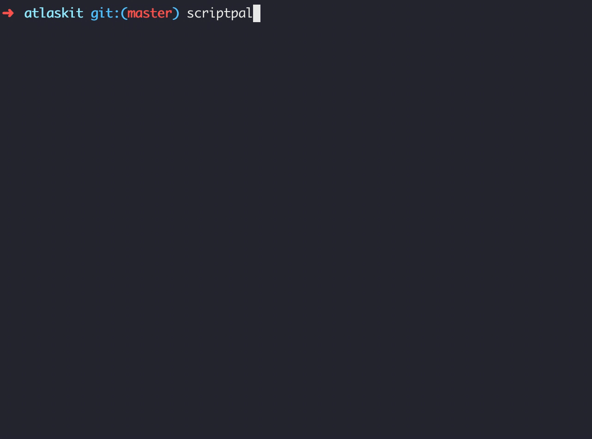

<p align="center">
  
</p>

# ScriptPal 🤘

A simple npm script palette for lazy people who want a quick way to look through and pick npm scripts!

- keyboard navigation
- autocompletion
- fuzzy finding
- bookmarks

<p align="center">
  
</p>

## Install ⬇️

Install globally

```bash
npm install -g scriptpal
```

## Usage 🏁

```bash
scriptpal
```

Usage with npx

```bash
npx scriptpal
```

## API 🤖

- `--nowelcome`, `-n` Omit welcome message
- `--last`, `-l` Run previous command
- `--version`, `-v` Version number
- `--clipboard`, `-c` Copy command to clipboard
- `--help` Help me 🙏
- `list`, `ls` List local npm scripts from `package.json`
- `bookmark add <name> <command...>` Add a bookmark
- `bookmark edit <name> <command...>` Edit a bookmark
- `bookmark remove <name>`, `bookmark rm <name>` Remove a bookmark
- `bookmark list`, `bookmark ls` List bookmarks
- `bookmark run <name> [name=value ...]` Run a bookmark and resolve wildcards
- `bookmark --last`, `bookmark -l` Run previous bookmark command
- `bookmark` Open a fuzzy-findable bookmark picker and run selection

## Running Arbitrary Scripts

It's possible to also run arbitrary scripts from your `package.json` by passing them as sub-commands, similar to `yarn`.

For example: `scriptpal test` will run `npm run test`.

## `list` / `ls`

`list` List all scripts found in local `package.json`.

## `bookmark`

Store reusable command bookmarks globally.

Wildcards use `${name}` syntax and are resolved when running bookmarks.
If a required wildcard is not provided, ScriptPal prompts for it.
When passing wildcard values via CLI, use `name=value` pairs with non-empty names and values.

Bookmark names must be non-empty and cannot be `__proto__`, `prototype`, or `constructor`.

## Examples

- `$ scriptpal` => Shows a prompt containing a list of npm scripts from the closest `package.json`.
- `$ scriptpal --last` => Runs the previous command
- `$ scriptpal list` / `$ scriptpal ls` => Prints all npm scripts from the closest `package.json`.
- `$ scriptpal start` => Runs `npm run start`. Can be used with other scripts as well.
- `$ scriptpal bookmark add testpkg "yarn test src/packages/${package}"` => Saves a bookmark.
- `$ scriptpal bookmark run testpkg package=ui-button` => Runs `yarn test src/packages/ui-button`.
- `$ scriptpal bookmark --last` => Runs the last executed bookmark command.
- `$ scriptpal bookmark ls` => Lists bookmarks.
- `$ scriptpal bookmark` => Opens fuzzy picker for saved bookmarks and runs selected one.

## You might also like...

- [CommitPal](https://github.com/zeropoly/commitpal): A delightful CLI tool for building complex commit messages
- [Enquirer](https://github.com/enquirer/enquirer): Stylish, intuitive and user-friendly prompts
