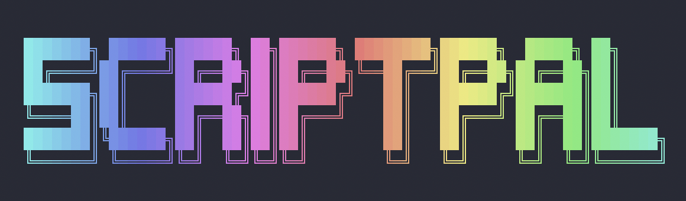

<p align="center">
  
</p>

# ScriptPal 🤘

A simple npm script palette for lazy people who want a quick way to look through and pick npm scripts!

- keyboard navigation
- autocompletion
- fussy finding

<p align="center">
  
</p>

## Install ⬇️

Install globally

```bash
npm install -g scriptpal
```

## Usage 🏁

```bash
scriptpal
```

Usage with npx

```bash
npx scriptpal
```

## API 🤖

- `--nowelcome`, `-n` Omit welcome message
- `--last`, `-l` Run previous command
- `--version`, `-v` Version number
- `--clipboard`, `-c` Copy command to clipboard
- `--help` Help me 🙏

## Examples

- `$ scriptpal --nowelcome`
- `$ npx scriptpal`
- `$ scriptpal --last --preset="emoji"`

## You might also like...

- [CommitPal](https://github.com/zeropoly/commitpal): A delightful CLI tool for building complex commit messages
- [Enquirer](https://github.com/enquirer/enquirer): Stylish, intuitive and user-friendly prompts
